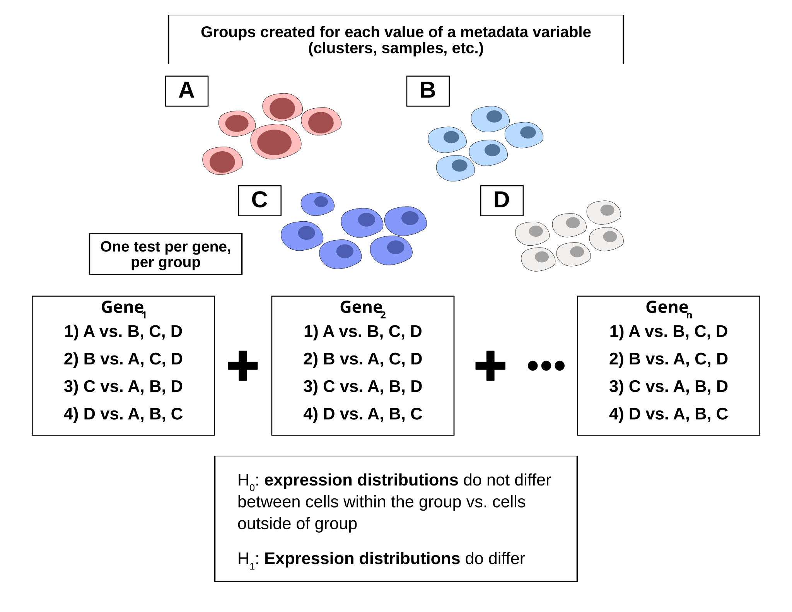
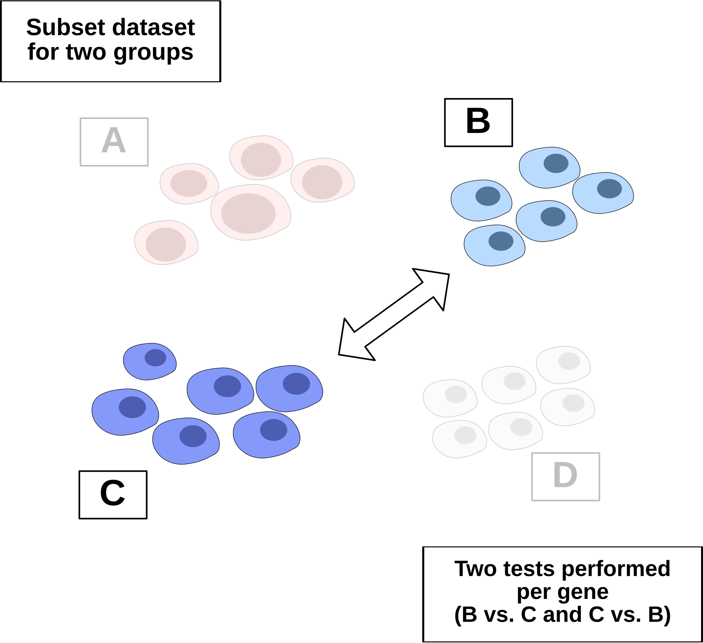

# scDE Usage and Examples

## Unified Interface for DGE Functions

This package is a wrapper for several differential expression functions,
which are executed based on the class of the single cell object passed.
The computations performed by each function are not modified by this
package, and slight differences in output are observed for each
function.

##### Functions Applied

| Object Format | Package | Function |
|----|----|----|
| Seurat | presto | \`presto::wilcoxauc\` |
| Seurat v5 (with BPCells Count Matrix) | BPCells | \`BPcells::marker_features\` |
| Anndata | scanpy | \`scanpy.tl.rank_genes_groups\` |
| SingleCellExperiment |  | Not yet supported |

This vignette will overview the process of differential gene expression,
and will demonstrate usage `run_dge` function to perfrom common
analyses.

## DGE Overview

The general process of differential gene expression testing for single
cell data is outlined in the diagram below. Groups of cells are
identified based on a chosen metadata variable in the object. For each
gene and group, expression distributions are compared for all cells
within the group vs. cells outside of the group. All functions involve
the use of the wilcoxon rank sum, a non-parametric test widely used on
single cell data due to the extreme sparsity of datasets and non-normal
expression distributions observed. For non-parametric tests, the null
hypothesis is based on a comparison of the distributions between two
groups, rather than the means. Therefore, a rejection of the null
hypothesis for a gene within a group indicates a statistically
significant difference in the expression distributions observed, rather
than in the mean expression values.



## Marker Identification

Marker identification is the process of identifying genes that
distinguish a group from other cells in a dataset.

An example of marker identification is given here. The object used for
this example is a subset of an accute myeloid leukemia reference dataset
originally generated by Triana et al. (Nature Immunology, 2021). The
dataset is included with this package and can by loaded by running
`AML_Seurat`.

To perform marker identification, first identify the metadata variable
used for defining groups. We will use the variable for cell type to
start, which is “condensed_cell_type” in this object.

To preview the groups that will be created, you can print the unique
values for condensed_cell_type in the object. The SCUBA package provides
a shortcut for this operation.

``` r

SCUBA::unique_values(AML_Seurat, "condensed_cell_type")
```

    ##  [1] "Plasma cells"                 "Primitive"                   
    ##  [3] "Dendritic cells"              "Plasmacytoid dendritic cells"
    ##  [5] "BM Monocytes"                 "NK Cells"                    
    ##  [7] "CD8+ T Cells"                 "B Cells"                     
    ##  [9] "CD4+ T Cells"                 "PBMC Monocytes"

Next, simply call `run_dge` to perform differntial expression testing.
Set group_by to “condensed_cell_tpe” to use this variable for grouping.

``` r

table <- scDE::run_dge(
  AML_Seurat,
  group_by = "condensed_cell_type"
  )

table
```

    ## # A tibble: 4,620 × 9
    ##    group   feature avgExpr log2FC   auc     pval pval_adj pct_in pct_out
    ##    <chr>   <chr>     <dbl>  <dbl> <dbl>    <dbl>    <dbl>  <dbl>   <dbl>
    ##  1 B Cells MS4A1      4.48   6.26 1     2.43e-36 1.12e-33    100    7.56
    ##  2 B Cells CXCR5      2.22   3.13 0.854 5.78e-31 1.33e-28     72    2.22
    ##  3 B Cells VPREB3     2.41   3.40 0.875 4.12e-30 6.34e-28     76    3.56
    ##  4 B Cells CD24       1.77   2.52 0.796 3.80e-26 4.39e-24     60    1.78
    ##  5 B Cells CD79A      4.86   6.24 0.993 3.27e-25 3.02e-23    100   18.7 
    ##  6 B Cells CD79B      3.51   4.51 0.966 2.02e-22 1.33e-20     96   19.6 
    ##  7 B Cells IGHD       2.91   4.02 0.850 1.97e-22 1.33e-20     72    6.67
    ##  8 B Cells CD19       2.34   3.11 0.839 1.35e-17 7.78e-16     72   10.7 
    ##  9 B Cells CD37       4.96   2.83 0.980 3.65e-15 1.87e-13    100   93.3 
    ## 10 B Cells IGHM       4.60   5.84 0.874 8.94e-15 4.13e-13     80   22.2 
    ## # ℹ 4,610 more rows

Each row in the output table represents a test run on a gene-group
combination. The output format is similar to the output of presto. The
columns are as following:

- Group: the group for which the indididual test was performed.
- Feature: the gene for which the test was performed.
- AvgExpr: the average expression of the gene within the group
- LogFC/Log2FC: the log fold change between the expression of the gene
  in the group, vs. the expression of the gene outside of the group.
- AUC: area under the recieving operator curve for the gene. The AUC
  metric indicates the degree to which the gene can serve as a marker
  for the current group, by distinguishing it from all other cells.
- pval: the p-value computed from the wilcoxon rank sum.
- pval_adj: the adjusted p-value. For presto, this is a
  Benjamini-Hochberg correction.
- pct_in: The percent of cells within the group expressing the gene.
- pct_out: The percent of cells outside the group expressing the gene.

The table can be subsetted to view the best markers for each group.
`dplyr` is used below, but base R subsetting can also be used.

``` r

table |> 
  dplyr::filter(group == "Plasma cells")
```

    ## # A tibble: 462 × 9
    ##    group        feature avgExpr log2FC    auc     pval pval_adj pct_in pct_out
    ##    <chr>        <chr>     <dbl>  <dbl>  <dbl>    <dbl>    <dbl>  <dbl>   <dbl>
    ##  1 Plasma cells MZB1       4.16   5.42 0.988  2.54e-27 1.17e-24    100    14.7
    ##  2 Plasma cells DERL3      2.61   3.32 0.905  1.85e-21 4.28e-19     92    12  
    ##  3 Plasma cells JCHAIN     5.83   7.41 0.946  6.92e-21 1.06e-18     92    19.6
    ##  4 Plasma cells FKBP11     2.93   3.59 0.934  1.14e-19 1.31e-17     96    19.6
    ##  5 Plasma cells SEC11C     3.27   3.73 0.961  1.68e-17 1.55e-15    100    33.8
    ##  6 Plasma cells SSR4       1.36   1.73 0.784  1.73e-13 1.33e-11     64    10.2
    ##  7 Plasma cells ITM2C      3.21   3.41 0.876  5.00e-13 3.30e-11    100    28  
    ##  8 Plasma cells CD79A      3.02   3.29 0.839  1.08e-12 6.23e-11     92    19.6
    ##  9 Plasma cells FTH1       3.32  -2.25 0.0684 1.49e-12 7.64e-11     96   100  
    ## 10 Plasma cells HSP90B1    4.37   2.86 0.929  1.80e-12 8.31e-11    100    82.2
    ## # ℹ 452 more rows

Sorting in descending order by log-fold change or by AUC will show the
top markers.

``` r

table |> 
  dplyr::filter(group == "Plasma cells") |> 
  dplyr::arrange(desc(auc)) 
```

    ## # A tibble: 462 × 9
    ##    group        feature avgExpr log2FC   auc     pval pval_adj pct_in pct_out
    ##    <chr>        <chr>     <dbl>  <dbl> <dbl>    <dbl>    <dbl>  <dbl>   <dbl>
    ##  1 Plasma cells MZB1       4.16   5.42 0.988 2.54e-27 1.17e-24    100    14.7
    ##  2 Plasma cells SEC11C     3.27   3.73 0.961 1.68e-17 1.55e-15    100    33.8
    ##  3 Plasma cells JCHAIN     5.83   7.41 0.946 6.92e-21 1.06e-18     92    19.6
    ##  4 Plasma cells FKBP11     2.93   3.59 0.934 1.14e-19 1.31e-17     96    19.6
    ##  5 Plasma cells HSP90B1    4.37   2.86 0.929 1.80e-12 8.31e-11    100    82.2
    ##  6 Plasma cells DERL3      2.61   3.32 0.905 1.85e-21 4.28e-19     92    12  
    ##  7 Plasma cells XBP1       3.55   3.15 0.894 1.95e-11 8.21e-10    100    53.8
    ##  8 Plasma cells IGKC       7.00   7.87 0.883 2.79e-11 1.08e- 9     88    48  
    ##  9 Plasma cells ITM2C      3.21   3.41 0.876 5.00e-13 3.30e-11    100    28  
    ## 10 Plasma cells CD79A      3.02   3.29 0.839 1.08e-12 6.23e-11     92    19.6
    ## # ℹ 452 more rows

### Common Syntax Accross Object Formats

Marker identification can be performed on anndata objects using the
exact same syntax. In the example below, marker identification is
performed on the same reference object in an anndata format.

``` r

# Load reference object in anndata format
AML_h5ad()
```

    ## AnnData object with n_obs × n_vars = 250 × 462
    ##     obs: 'nCount_RNA', 'nFeature_RNA', 'nCount_AB', 'nFeature_AB', 'nCount_BOTH', 'nFeature_BOTH', 'BOTH_snn_res.0.9', 'seurat_clusters', 'Prediction_Ind', 'BOTH_snn_res.1', 'ClusterID', 'Batch', 'x', 'y', 'x_mean', 'y_mean', 'cor', 'ct', 'prop', 'meandist', 'cDC', 'B.cells', 'Myelocytes', 'Erythroid', 'Megakaryocte', 'Ident', 'RNA_snn_res.0.4', 'condensed_cell_type'
    ##     var: 'vst.mean', 'vst.variance', 'vst.variance.expected', 'vst.variance.standardized'
    ##     obsm: 'X_pca', 'X_umap', 'protein'
    ##     layers: 'counts'

``` r

# Perform the same marker analysis as above
scDE::run_dge(
  AML_h5ad(),
  group_by = "condensed_cell_type"
  )
```

    ## # A tibble: 4,620 × 7
    ##    group   feature log2FC     pval pval_adj pct_in pct_out
    ##    <chr>   <chr>    <dbl>    <dbl>    <dbl>  <dbl>   <dbl>
    ##  1 B Cells MS4A1     9.14 2.41e-16 1.12e-13   1     0.0756
    ##  2 B Cells CD79A     7.50 6.03e-16 1.39e-13   1     0.187 
    ##  3 B Cells CD37      2.90 3.63e-15 5.59e-13   1     0.933 
    ##  4 B Cells CD79B     6.13 2.25e-14 2.60e-12   0.96  0.196 
    ##  5 B Cells SRGN     -4.70 1.55e-12 1.43e-10   0.36  0.96  
    ##  6 B Cells GSTP1    -5.71 1.23e-11 9.46e-10   0.12  0.893 
    ##  7 B Cells CD52      2.31 2.33e-11 1.54e- 9   1     0.92  
    ##  8 B Cells FCMR      4.52 3.21e-11 1.85e- 9   0.92  0.364 
    ##  9 B Cells CD74      2.78 8.86e-11 4.55e- 9   1     0.951 
    ## 10 B Cells VPREB3    7.48 8.04e-10 3.47e- 8   0.76  0.0356
    ## # ℹ 4,610 more rows

The output format is largely consistent, with the exception of the AUC
metric, which is not computed by Scanpy’s `rank_genes_groups`. The
average expression in the group is also not computed by the function.

## Differential Expression Between Two Groups

Oftentimes you will want to identify differentially expressed genes
between two groups of cells, instead of genes expressed in one group
vs. the rest of the cells. To do this, you will first subset the dataset
for the two groups of interest, and then call `run_dge` on the subsetted
object.

With two unique values present for the group_by metadata variable, two
tests will be performed per gene, for the first group vs. the second
group, and the second group vs. the first group. These tests will be
equivalent to one another, with the only difference being the log-fold
change, which will be inverted. Since these tests are redundant, it can
be hidden with `positive_only = TRUE` (see example below). When this is
set to `TRUE`, one test will appear per gene in the dataset, with the
**group in which it is upregulated**. Test results for genes that aren’t
expressed in either group will also be removed when this is set to
`TRUE`.



Using the example object, let’s say we want to determine genes that are
differentially expressed between BM (bone marrow) monocytes and PBMC
(peripheral blood) monocytes. To do this, we will subset the object for
these two values, and then run differential expression.

``` r

# Subset based on the condensed_cell_type variable for two cell types
subsetted_object <-
  subset(
    AML_Seurat,
    subset = condensed_cell_type %in% c("BM Monocytes", "PBMC Monocytes")
  )

# Run DGE, using the subset and the same metadata variable
run_dge(
  object = subsetted_object,
  group_by = "condensed_cell_type",
  # Show only groups where a gene is upregulated 
  positive_only = TRUE
  )
```

    ## # A tibble: 337 × 9
    ##    group        feature avgExpr log2FC   auc        pval pval_adj pct_in pct_out
    ##    <chr>        <chr>     <dbl>  <dbl> <dbl>       <dbl>    <dbl>  <dbl>   <dbl>
    ##  1 BM Monocytes HBB        1.87  2.70  0.96      1.31e-9  6.05e-7     92       0
    ##  2 BM Monocytes SRGN       5.01  0.990 0.958     2.87e-8  6.63e-6    100     100
    ##  3 BM Monocytes HERPUD1    2.75  2.27  0.926     2.12e-7  3.26e-5    100      56
    ##  4 BM Monocytes CXCR4      3.03  2.89  0.9       9.84e-7  1.14e-4     96      48
    ##  5 BM Monocytes DDIT4      1.42  2.05  0.82      2.95e-6  2.72e-4     64       0
    ##  6 BM Monocytes PTMA       4.20  1.43  0.872     6.75e-6  4.45e-4    100     100
    ##  7 BM Monocytes CD74       5.84  1.14  0.854     1.80e-5  1.04e-3    100     100
    ##  8 BM Monocytes KIR        3.25  1.65  0.837     4.57e-5  1.94e-3    100      80
    ##  9 BM Monocytes CTSS       4.03  1.01  0.837     4.61e-5  1.94e-3    100      96
    ## 10 BM Monocytes AIF1       4.21  1.05  0.829     6.96e-5  2.68e-3    100     100
    ## # ℹ 327 more rows
