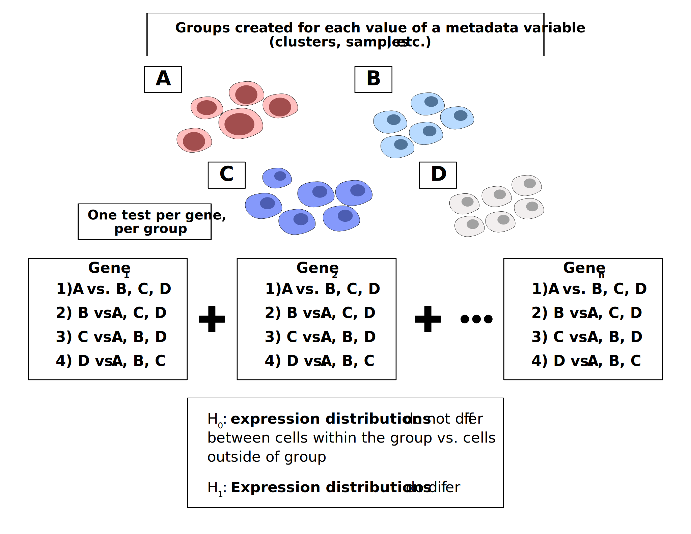
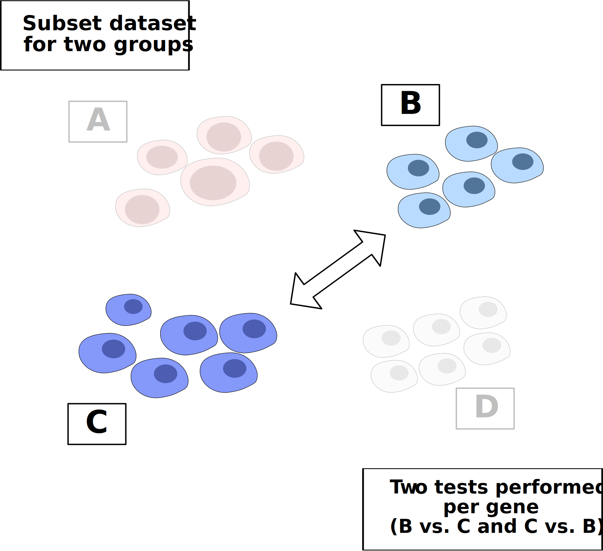

```{r setup, include=FALSE}
knitr::opts_chunk$set(echo = TRUE)

library(scDE)
```

```{scss document_css, echo = FALSE}
/* Centers text and block elements */
.center{
  text-align: center;
  /* Display must be set to block for centering to work */
  display: block;
}
  
/* Centers using margin attribute, which works 
  for elements that do not respond to 
  text-align:center*/
.margin-center{
  display: block;
  margin-left: auto;
  margin-right: auto;
}

.white-text{
  color: white;
}

/* Bootstrap card elements */
.card-header{
  /* Should make text white */
  color: #FFFFFF;
  /* RefinedScience steel blue */
  background-color: #217CA1;
  /* Adds a mrgin-top of 0 to the existing bootstrap class to remove white space
   that appears when using the card component in an Rmd */
  margin-top: 0px;
}

.table-header{
  border-style: solid;
  border-width: 0px 0px 4px 0px;
}

/* Adds padding between table columns */
th, td{
  padding: 0px 15px;
}

.card-body{
  /* RS Light Grey #708082 
     RS Dark Grey #4D5859 */
  background-color: #E1E1E1; 
  /* The border radius property is not properly inherited from the parent .card
    element. The reason is unknown, but explicitly defining it here fixes 
    the issue */
  border-radius: 0px 0px var(--bs-card-border-radius) var(--bs-card-border-radius);
}

/* CSS for callouts
   From https://codepen.io/superjaberwocky/pen/rLKxOa */
   /* Requires SASS to be enabled, with sass package and "scss" code chunk*/
.callout {
  padding: 20px;
  margin: 20px 0;
  border: 1px solid #eee;
  /* If the border-radius is greater than border-left-width,  
     the left border will curve inward onto the element's body,
     creating a cresent-like shape*/
  border-left-width: 8px;
  border-radius: 8px;
  h4, h5 {
    margin-top: 0;
    margin-bottom: 5px;
  }
  p:last-child {
    margin-bottom: 0;
  }
  code {
    border-radius: 3px;
  }
  & + .bs-callout {
    margin-top: -5px;
  }
}

/* Define properties for default, primary, info, etc. classes*/
@each $name,$color in 
  (default,#777),
  (primary,#428bca),
  (success,#5cb85c),
  (danger,#d9534f),
  (warning,#f0ad4e),
  (info,#5bc0de), 
  (bdc,#29527a){
  .callout-#{$name} {
    border-left-color: $color;
    /* Background: color above, with an alpha hex value of '35'*/
    background-color: #{$color + '35'};
    h4, h5 {
      color: $color;
    }
  }
}

/* Applied to output of code chunks. Causes a scrollbar to appear 
   when the output extends beyond the max-height. */
/* Adapted from https://bookdown.org/yihui/rmarkdown-cookbook/html-scroll.html */
/* Classes are defined for several max heights */
@each $height in 
  80,
  100,
  300{
  .scroll-#{$height} {
    max-height: #{$height + "px"};
    overflow-y: auto;
    background-color: inherit;
  }
}

/*
.scroll-80 {
  max-height: 80px;
  overflow-y: auto;
  background-color: inherit;
}

.scroll-100 {
  max-height: 100px;
  overflow-y: auto;
  background-color: inherit;
}

.scroll-300 {
  max-height: 300px;
  overflow-y: auto;
  background-color: inherit;
}*/
```

This package is a wrapper for several differential expression functions, which are executed based on the class of the single cell object passed. The computations performed by each function are not modified by this package, and slight differences in output are observed for each function.

::: {.card .mb-3}
::: card-header
<h4 class="card-title center">

Functions Used

</h4>
:::

::: card-body
+---------------------------------------+---------+---------------------------------+
| Object Format                         | Package | Function                        |
+=======================================+=========+=================================+
| Seurat                                | presto  | \`presto::wilcoxauc\`           |
+---------------------------------------+---------+---------------------------------+
| Seurat v5 (with BPCells Count Matrix) | BPCells | \`BPcells::marker_features\`    |
+---------------------------------------+---------+---------------------------------+
| Anndata                               | scanpy  | \`scanpy.tl.rank_genes_groups\` |
+---------------------------------------+---------+---------------------------------+
| SingleCellExperiment                  |         | Not yet supported               |
+---------------------------------------+---------+---------------------------------+
:::
:::

```{=html}
<!--
::: {.callout .callout-info}
<h4> Note </h4>
Results are returned exactly as they are computed by each function, with the exception of log-fold change values in expression between groups, which is converted from a natural-log format in presto to a log-2 format. There are slight differences in p-values and log-fold change results between different object classes due to the specific computations performed by each function.
:::
-->
```
This vignette will overview the process of differential gene expression, and will demonstrate usage `run_dge` function to perfrom common analyses.

# DGE Overview

The general process of differential gene expression testing for single cell data is outlined in the diagram below. Groups of cells are identified based on a chosen metadata variable in the object. For each gene and group, expression distributions are compared for all cells within the group vs. cells outside of the group. All functions involve the use of the wilcoxon rank sum, a non-parametric test widely used on single cell data due to the extreme sparsity of datasets and non-normal expression distributions observed. For non-parametric tests, the null hypothesis is based on a comparison of the distributions between two groups, rather than the means. Therefore, a rejection of the null hypothesis for a gene within a group indicates a statistically significant difference in the expression distributions observed, rather than in the mean expression values.



# Marker Identification

Marker identification is the process of identifying genes that distinguish a group from other cells in a dataset.

An example of marker identification is given here. The object used for this example is a subset of an accute myeloid leukemia reference dataset originally generated by Triana et al. (Nature Immunology, 2021). The dataset is included with this package and can by loaded by running `AML_Seurat`.

To perform marker identification, first identify the metadata variable used for defining groups. We will use the variable for cell type to start, which is "condensed_cell_type" in this object.

To preview the groups that will be created, you can print the unique values for condensed_cell_type in the object. The SCUBA package provides a shortcut for this operation.

```{r unique_values}
SCUBA::unique_values(AML_Seurat, "condensed_cell_type")
```

Next, simply call `run_dge` to perform differntial expression testing. Set group_by to "condensed_cell_tpe" to use this variable for grouping.

```{r run_dge-marker_id}
table <- scDE::run_dge(
  AML_Seurat,
  group_by = "condensed_cell_type"
  )

table
```

Each row in the output table represents a test run on a gene-group combination. The output format is similar to the output of presto. The columns are as following:

-   Group: the group for which the indididual test was performed.
-   Feature: the gene for which the test was performed.
-   AvgExpr: the average expression of the gene within the group
-   LogFC/Log2FC: the log fold change between the expression of the gene in the group, vs. the expression of the gene outside of the group.
-   AUC: area under the recieving operator curve for the gene. The AUC metric indicates the degree to which the gene can serve as a marker for the current group, by distinguishing it from all other cells. <!--[CITE presto paper, AUC paper]-->
-   pval: the p-value computed from the wilcoxon rank sum.
-   pval_adj: the adjusted p-value. For presto, this is a Benjamini-Hochberg correction. <!-- CITE presto -->
-   pct_in: The percent of cells within the group expressing the gene.
-   pct_out: The percent of cells outside the group expressing the gene.

The table can be subsetted to view the best markers for each group. `dplyr` is used below, but base R subsetting can also be used.

```{r view_different_groups}
table |> 
  dplyr::filter(group == "Plasma cells")
```

Sorting in descending order by log-fold change or by AUC will show the top markers.

```{r sort_ascending}
table |> 
  dplyr::filter(group == "Plasma cells") |> 
  dplyr::arrange(desc(auc)) 
```

## Common syntax accross object formats

Marker identification can be performed on anndata objects using the exact same syntax. In the example below, marker identification is performed on the same reference object in an anndata format.

```{r}
# Load reference object in anndata format
AML_h5ad()
```

```{r}
# Perform the same marker analysis as above
scDE::run_dge(
  AML_h5ad(),
  group_by = "condensed_cell_type"
  )
```

The output format is largely consistent, with the exception of the AUC metric, which is not computed by Scanpy's `rank_genes_groups`. The average expression in the group is also not computed by the function.

# Differential expression between two groups

Oftentimes you will want to identify differentially expressed genes between two groups of cells, instead of genes expressed in one group vs. the rest of the cells. To do this, you will first subset the dataset for the two groups of interest, and then call `run_dge` on the subsetted object.

With two unique values present for the group_by metadata variable, two tests will be performed per gene, for the first group vs. the second group, and the second group vs. the first group. These tests will be equivalent to one another, with the only difference being the log-fold change, which will be inverted. Since these tests are redundant, it can be hidden with `positive_only = TRUE` (see example below). When this is set to `TRUE`, one test will appear per gene in the dataset, with the **group in which it is upregulated**. Test results for genes that aren't expressed in either group will also be removed when this is set to `TRUE`.

{.margin-center width="70%"}

Using the example object, let's say we want to determine genes that are differentially expressed between BM (bone marrow) monocytes and PBMC (peripheral blood) monocytes. To do this, we will subset the object for these two values, and then run differential expression.

```{r}
# Subset based on the condensed_cell_type variable for two cell types
subsetted_object <-
  subset(
    AML_Seurat,
    subset = condensed_cell_type %in% c("BM Monocytes", "PBMC Monocytes")
  )

# Run DGE, using the subset and the same metadata variable
run_dge(
  object = subsetted_object,
  group_by = "condensed_cell_type",
  # Show only groups where a gene is upregulated 
  positive_only = TRUE
  )
```

